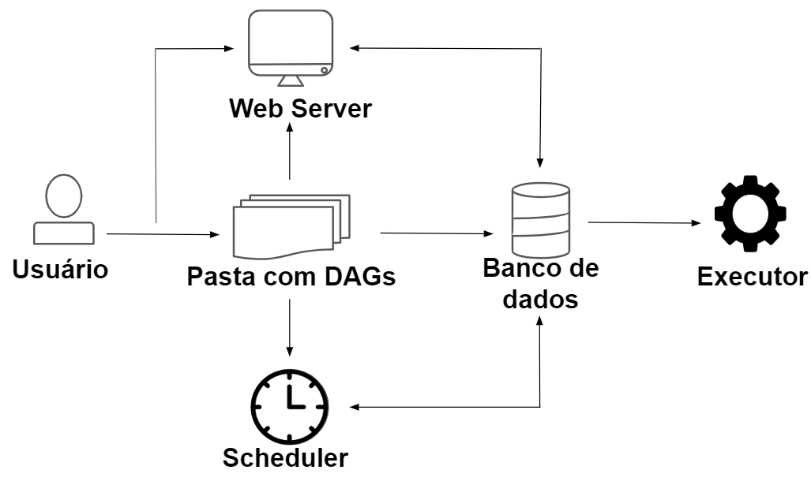

# Apache AirFlow

 O Apache Airflow é uma ferramenta open source que foi criada pelo Airbnb em 2014 e atualmente faz parte da Apache Software Foundation. Trata-se de um orquestrador de fluxos, ou seja, nos permite decidir em qual momento e em quais condições nosso programa irá rodar. É utilizada principalmente para criação, monitoramento e agendamento de pipeline de dados de forma programática.

 ## Características 

 Entre as características do Apache Airflow, podemos citar que é dinâmico, porque todos os seus pipelines de dados são definidos em Python, então tudo o que conseguimos realizar nesta linguagem, também pode ser feito no Airflow; é extensível porque nos permite conectar a várias outras ferramentas do ecosistema de dados; é escalável, então uma vez que temos poder computacional suficiente, conseguimos orquestrar inúmeras quantidades de pipeline de dados independentemente da complexidade desses pipelines; é elegante, porque conseguimos desenvolver datas pipelines de forma enxuta e direta; e, por fim, possui uma interface web útil e fácil de utilizar.

 --

## Open Sourse

 O fato de ser uma ferramenta open source configura uma vantagem porque conseguimos compartilhar melhorias e interagir com a comunidade. Além disso, é muito utilizado para desenvolvimento de pipelines ETL e ELT, treinamento de modelos de Machine Learning, geração de relatórios automatizada e backups automáticos.

 No contexto do nosso projeto, podemos desenvolver nosso data pipeline no Airflow e agendar sua execução de forma automática para toda segunda-feira. Mas, para que possamos fazer isso, precisamos entender um pouco mais sobre o funcionamento dessa ferramenta.

 ---

 # Principais Conceitos da Ferramenta

 ## DAG - Directed Acyclic Graph

Um DAG é basicamente um fluxo de trabalho, um pipeline de dados definido em Python que trata-se de um conjunto de instruções que precisam ser executadas em uma determinada ordem. Ao definirmos um data pipeline no Airflow, este passa a ser um DAG.

## Task

Uma task ("tarefa" em português) é a unidade mais básica de um DAG e é utilizada para implementar uma determinada lógica no pipeline. Podemos afirmar, portanto, que um DAG também é um conjunto de tasks onde cada uma dessas tarefas corresponde a uma etapa que precisa ser realizada no pipeline de dados.

**Um DAG é um Conjunto de Task**

## DAG RUN

DAG run, ou "execução de DAG" em português, como o próprio nome sugere, trata-se da execução propriamente dita de um DAG no tempo. Este DAG run inclui algumas informações sobre a execução do DAG, entra elas podemos citar o horário e tempo de execução de cada tarefa. Em suma, trata-se da instância de um DAG no tempo.

## Task Instance 

Task instanece, ou "instância de tarefa" em português, é a execução de uma tarefa em um ponto específico do DAG. Além disso, quando trabalhamos com DAGs, interagimos principalmente com operators (operadores), que são os blocos de construção de um DAG. Esses operators contêm a lógica de como os dados são processados em um data pipeline e cada tarefa é definida justamente pela instanciação de um operador.

## Operator 

Blocos de Construção de um DAG
Lógica de como os dados são processados no Datapipeline

---

# Resumo

- DAG: fluxo de trabalho definido em Python.

- Task: unidade mais básica de um DAG.

- Operator: encapsula a lógica para fazer uma unidade de trabalho (task).

More infos: 
https://airflow.apache.org/docs/apache-airflow/2.3.2/

---

# Arquitetura do AirFlow

## Web Server 

O web server é um servidor feito em Flask, um framework web Pyhton, que serve para nos apresentar a interface de usuário do Airflow, portanto, é por meio dele que acessamos esta interface.

## Scheduler -- Agendador

O scheduler ("agendador" em português) é responsável pelo agendamento da execução das tarefas dos DAGs, então ele determina quais tarefas serão realizadas, onde serão executadas e em qual ordem isso acontecerá.

## Banco de Dados

O banco de dados, por sua vez, serve para armazenar todos os metadados referentes aos DAGs. Sendo assim, ele registra o horário em que as tarefas foram executadas, quanto tempo cada task levou para ser realizada e o estado de cada uma - se foram executadas com sucesso ou falha, e outras informações relacionadas.

## Executor

Por fim, temos o executor, que é o mecanismo de execução das tarefas. Ou seja, ele é responsável por descobrir quais recursos serão necessários para executar essas tasks.

# Como trabahão juntos?? 

       --> Web Server ------------
      |                          |
User -> Pasta de DAGs ---> Banco de Dados -->Executor
               |                 |
            Scheduler  ----------
More infos about Airflow Architecture
https://airflow.apache.org/docs/apache-airflow/2.3.2/concepts/overview.html
