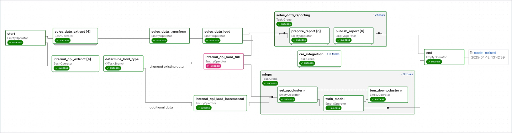
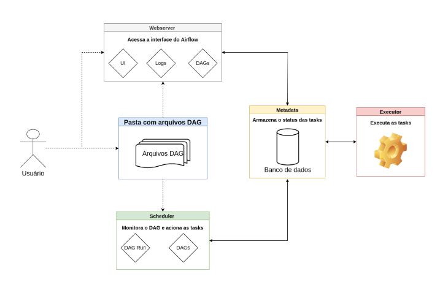

# AirFlow 

O Airflow é uma plataforma open-source escrita em Python que possui como objetivos criar, agendar e monitorar fluxos de trabalho. Pense nessa ferramenta como um maestro que é capaz de orquestrar os músicos durante a execução de determinada música, definindo quem começa, quais instrumentos tocam juntos, o tempo de execução de cada instrumento.

# O que é um DAG?

DAG é uma abreviação para “Directed Acyclic Graphs” - Grafos Acíclicos Dirigidos em tradução livre.

- Grafo é uma ferramenta matemática com nós e arestas responsáveis por conectar esses nós.

- Dirigidos quer nos dizer que o fluxo de trabalho se dá apenas em uma direção.

- Acíclico significa que a execução não entrará em um laço de repetição, então eventualmente acabaremos em um nó final que não estará conectado com o nó inicial.

A principal ideia do Airflow é dividir um trabalho grande com uma ou mais etapas em “tarefas” individuais que chamaremos de tasks, tarefas em inglês, e essas tasks juntas formam um DAG.

Uma task é a unidade mais básica de um DAG, é responsável por implementar determinada lógica no pipeline.

# Principais conceitos no Airflow

## Webserver
É o responsável por oferecer a interface de usuário do Airflow que torna possível visualizar de forma geral o estado dos DAGs, códigos que estão presentes nesses DAGs, estados de execução, logs de erro, entre outras funcionalidades. Também permite gerenciar usuários, funções e diversas configurações do Airflow.

## Metadata Database
O Airflow possui suporte para uma grande variedade de bancos de dados. É nesses bancos de dados que estão todas as informações a respeito dos DAGs, suas configurações, além de todas as configurações internas do Airflow, como os usuários e seus níveis de acesso. Ao realizarmos qualquer modificação no Webserver essas modificações são atualizadas no banco de dados de metadados (Metadata Database) pelo Scheduler (Agendador).

## Scheduler
O Scheduler (agendador) é responsável por assegurar que as tasks dentro de um DAG sejam executadas no momento adequado. Em outras palavras, o scheduler é um processo que cuida do agendamento dos fluxos de trabalho e faz o envio das tasks para o executor, seguindo as etapas:

- Faz a leitura dos arquivos DAG criado pelo usuário, extrai as informações e as coloca no banco de dados;
- Determina quais tarefas serão executadas e as coloca no estado enfileirado para executar na ordem correta; e
- Busca e executa as tarefas que estão no estado enfileirado.

## Executor
Executor é o mecanismo que trata do modo de execução das tasks. O Airflow permite apenas um executor configurado por vez e inicialmente ele é definido no momento da instalação. Existem dois tipos de executores, os que executam as tarefas localmente e os que fazem isso de forma remota. Abaixo estão alguns executores locais e remotos

## Operator
Operator é o componente que determina qual ferramenta será utilizada para executar as tasks. As tasks podem utilizar diferentes tecnologias, por exemplo, poderíamos primeiro rodar um script Bash na primeira task, a segunda poderia ser um script em Python, etc. O Airflow fornece uma grande variedade de operadores. Para trabalhar com tasks escritas em Python utilizamos o PythonOperator. Já para trabalhar com scripts Bash será utilizado o BashOperator. Em trabalhos mais complexos poderemos utilizar o DockerOperator que irá executar um comando dentro de um container Docker e você pode ainda criar seu próprio operador.

