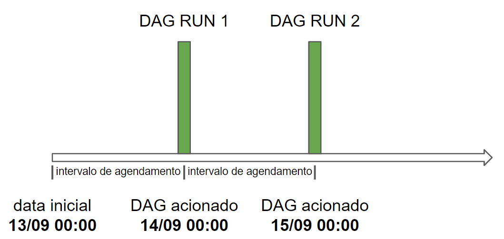

Um dos recursos mais fundamentais do Apache Airflow é a capacidade de agendar trabalhos. Dessa forma, é importante conhecermos alguns termos do Airflow que são relacionados ao agendamento:

Data de início (start date): data em que o DAG começa a ser agendado. Essa data é o início do intervalo de dados que você deseja processar;

Intervalo de agendamento (schedule interval): define o intervalo de tempo em que o DAG é acionado. Por exemplo, "@daily" significa que o DAG deve ser acionado todos os dias à meia-noite;

Intervalo de dados (data interval): propriedade de cada DAG Run que representa o intervalo de tempo em que cada tarefa deve operar. Por exemplo, para um DAG agendado de dia em dia, cada intervalo de dados começará no início (00:00) e terminará no final do dia (23:59). A execução do DAG acontece no final do intervalo de dados;

Data lógica (logical date): é a mesma do início do intervalo de dados. Não representa quando o DAG será realmente executado. Antes do Airflow 2.2, era chamada de data de execução.

É importante ressaltar que o DAG só é acionado após a data de início + o intervalo de agendamento, ou seja, no final do intervalo de dados. Por exemplo: se temos um DAG com a data de início igual a 13/09 e com o schedule interval igual a "@daily", indicando que ele deve ser executado todos os dias à meia noite, sua dinâmica de execução vai ser a seguinte:

More infos
https://airflow.apache.org/docs/apache-airflow/2.2.3/concepts/scheduler.html
https://airflow.apache.org/docs/apache-airflow/2.2.3/dag-run.html