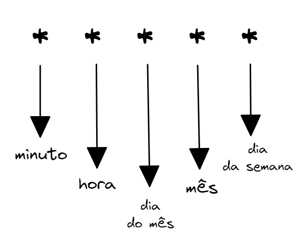

# Cron Expressions

Quando queremos definir intervalos de tempo um pouco mais complexos para a execução do nosso DAG, o Airflow permite a utilização das chamadas Cron Expressions. A sintaxe delas consiste em 5 componentes:



Sendo os valores possíveis para cada um desses componentes:

minuto: 0-59;
hora: 0-23;
dia do mês: 1-31;
mês: 1-12;
dia da semana: 0-6 representando de domingo a sábado.

No caso do nosso DAG, queremos que ele seja executado toda segunda-feira do mês, às 00h00. Por isso, passamos a seguinte Cron Expression para o parâmetro schedule_interval:

```python
schedule_interval = 0 0 * * 1
```
More Infos:
https://en.wikipedia.org/wiki/Cron#CRON_expression